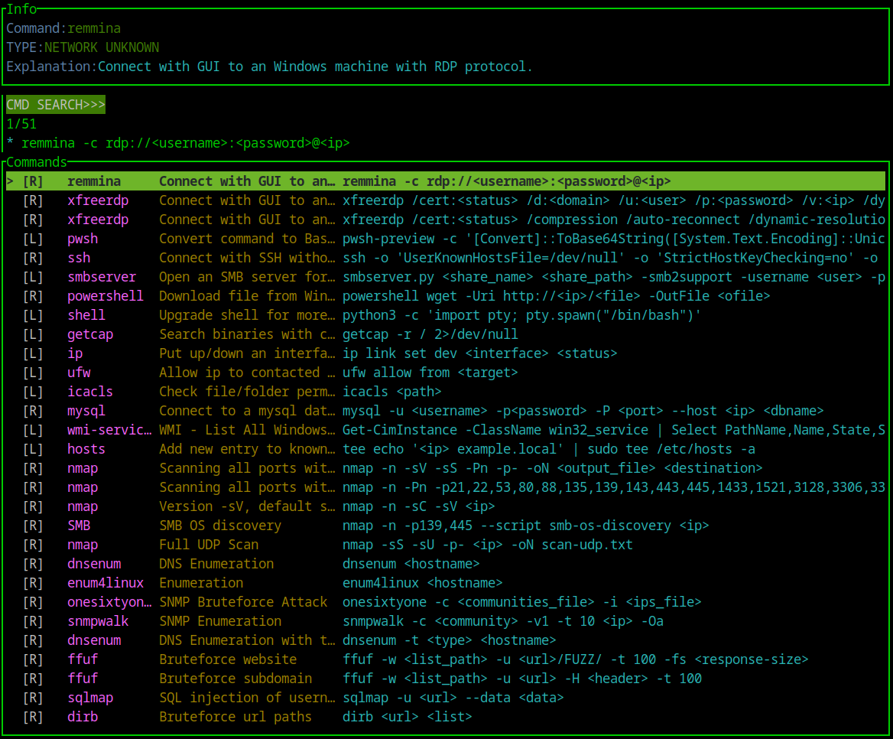
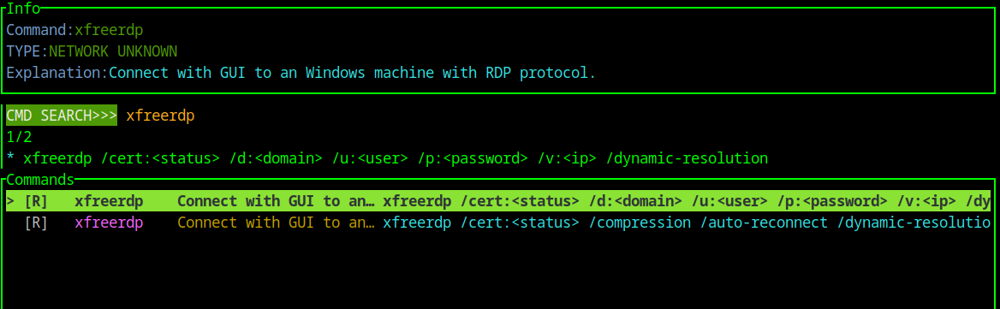
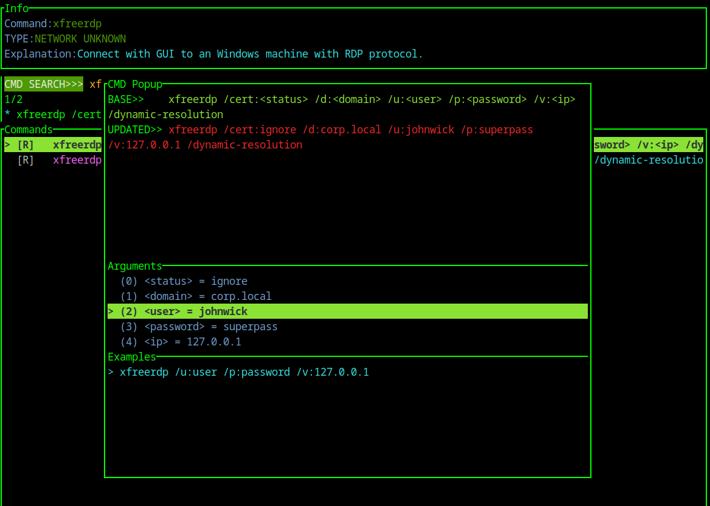

# CyberArsenal README
CyberArsenal is an inventory, reminder and launcher for linux/windows commands of all types (forensics, pentest, development, sysadmin, ...).

Support: Linux/Windows

## Building DB
To build the database, follow the instruction here: [Database installation](setup/README.md).

## Running CyberArsenal
To run the tool, for now it is only available through cargo locally: `cargo run -- -s <file.db>`. Just replace `file.db` with your database created during the setup.

Here are some quick images about the tool and how to use it:

*CyberArsenal Menu*

*CyberArsenal Search Example*

*CyberArsenal Popup Command*

Note: on `Windows` the command is `cargo run --target x86_64-pc-windows-msvc -- -s <file.db>`.

## CyberArsenal - How to use
- Using python and SQLite to create a database from a commands file toml
- Search bar to navigate through commands
- List of commands
- Hit `ENTER/EXIT`: enter or exit the command popup to type command data
- Inside command popup, copy/paste with `ENTER`. It copies the content of the command and its modified values
- Information panel
- Command are loaded from an `SQLite` file created during the setup

## Authors
- PpairNode

## TODO
For more information about what is next, see [TODO](docs/TODO.md).
