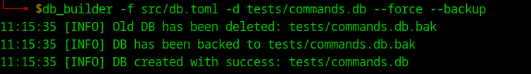

# Installation of DB

## Install dependencies
```bash
sudo apt install libsqlite3-dev
```

## Virtual ENV and installation of db_builder
In the `setup` directory:
```bash
python3 -m venv .env
source .env/bin/activate

pip3 install -e .
```

## Crafting the toml file
```t
title = "Pentest commands"
max_events = 100

[command.objdump0]
use_name = "objdump"
local = true
cmd_type = "reverse"
short_desc = "Display information from object <binary> in <type> format"
details = "..."
args = "-D <binary> -M <type|intel>"
examples = [
    "obdjump -M intel -D a.out"
]
```

A `[command.xxx]` block will load this as a command. All command keys are optional inside a command block.
The `xxx` will be used a key in the DB and validates that there is no duplicates from other loads (duplication will be skipped).
Understandable keys are:
- `use_name`: name to be used when talking about this tool. For example `Get-CimInstance -ClassName win32_services` is not very clear so I have written `wmi-services` as name. 
- `local`: local or remote purpose
- `cmd_types`: A `|` separated list of types for the command (supported are `pentest|forensics|programming|reverse|crypto|network|sysadmin|recon`)
- `short_desc`: an short description of the command
- `details`: details if the tool need more info
- `args`: all arguments of this command
    - An arg between `<k>`, will have a `k` key which can be modified from the tool.
    - An arg prompted like this `<k|v>`, has a auto-filled `k` key with the `v` value by default.
- `examples`: array of examples of how to use the command

## Run DB builder
```bash
# Builder helper
db_builder -h

usage: db_builder [-h] [-v] [-d DATABASE_NAME] -c CONFIG [-o] [-f] [-b]

SQLite Builder for CyberArsenal

options:
  -h, --help            show this help message and exit
  -v, --verbose         Enable verbose output
  -d DATABASE_NAME, --database-name DATABASE_NAME
                        Name of SQLite DB file
  -c CONFIG, --config CONFIG
                        Config file to add files into DB (toml)
  -o, --overwrite-db    Overwrite DB (delete actual)
  -f, --force-backup-overwrite
                        Overwrite old DB when used with `-b`
  -b, --backup          Backup DB

# Example: build from cyberarsenal folder
db_builder -c ../setup/data/config.toml -d tests/commands.db --force

# Open and check values has been inserted
sqlitebrowser sqlite.db

# Run cyberarsenal tool
cargo run -- -s tests/commands.db
```




## Cleaning Installation
```bash
make clean
```
